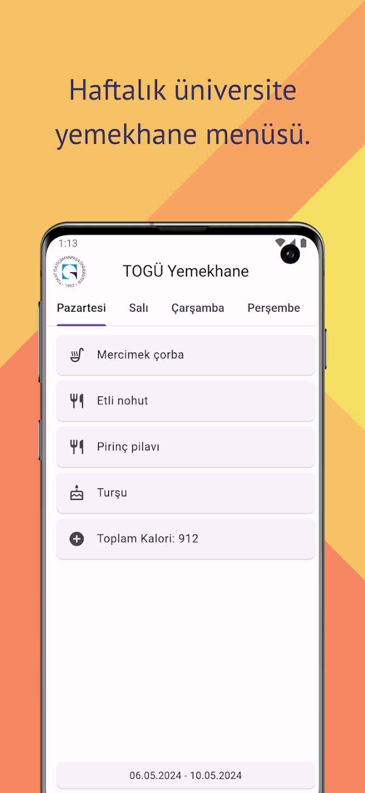
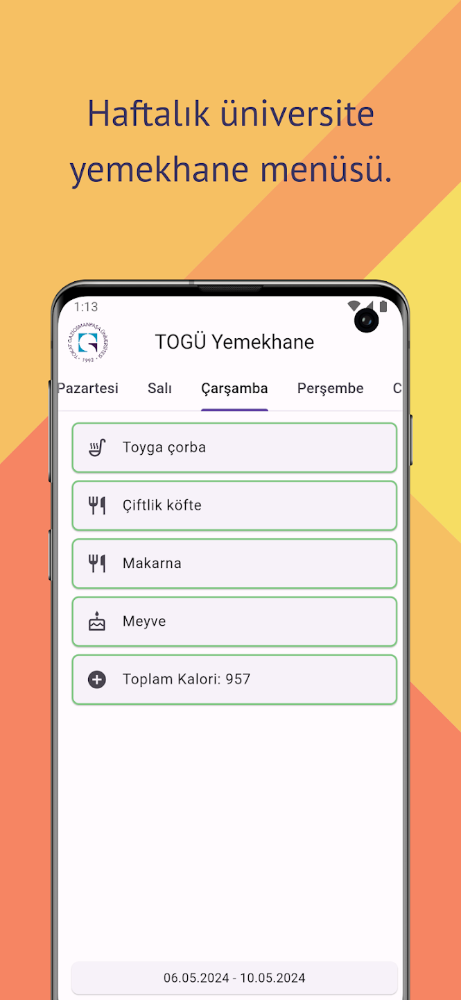

# TOGU Yemekhane

+ Tokat Gaziosmanpaşa Üniversitesi Sosyal Tesisler Yemekhane Menüsü'nü barındıran uygulama.

## Temel Özellikler:

+ Haftalık çıkan yemeklerin listesi.
+ İnternet erişimi olmadığında son kaydedilen haftaya ulaşım kolaylığı.

## Kurulum:

    git clone https://github.com/cusufcan/togu_yemekhane

## Ekran Görüntüleri:

<table>
    <tr>
        <td></td>
        <td></td>
    </tr>
</table>

## Kullanılan Teknolojiler:

+ Flutter & Dart
+ Firebase
+ Flutter Riverpod
+ HTML & HTTP
+ Shared Preferences

## Lisans:

    MIT
